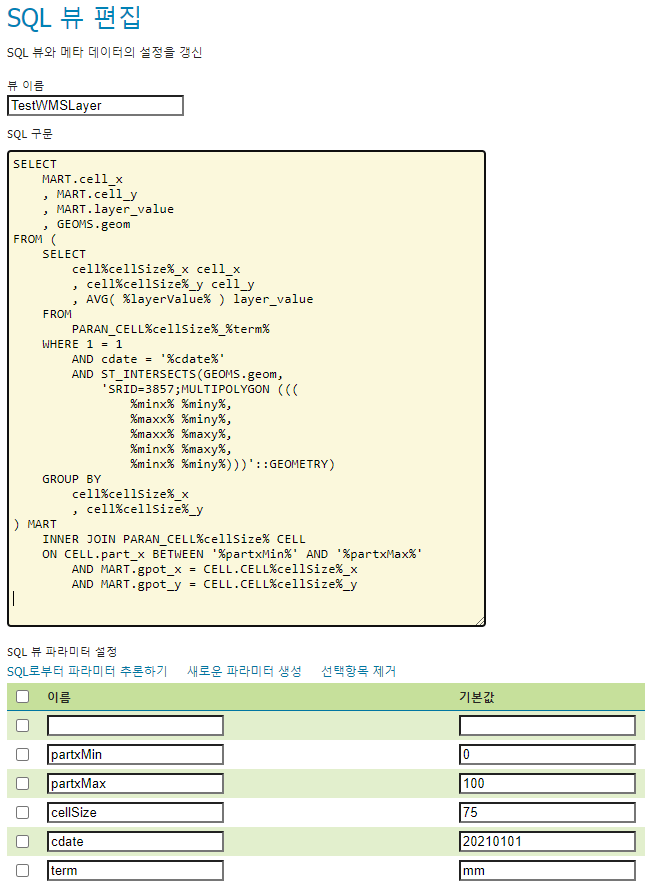

# Metageos


 We must utilize Edit `SQL View` at geoserver to handle flexible needs in PostGIS support.

 So, we consider ANSI SQL and PostGIS compatibility. especially, SQL **join** and table **partitioning** syntax for agility.

<br>

<p align="center">
  
</p>

## 1. Cockroach DB based auto scaling, auto sharding, auto rebalancing

- cloud based autoscale
  - K8S MSA
  - docker cluster MSA

`OL http request → geoserver cloud → Cockroach DB`

All nodes can utilize replication.

## 2. Adhoc scale out by PG Mannual Sharded cluster with request parameter based dynamic route gateway

- Adhoc with mannual sharding
  - On-premise host based

Use Spring cloud Gateway by WMS BBOX routing and Shareded PG.

```
OL http request → scg (WMS BBOX based request shard)
                     ↪ geoserver cloud
                        ├── geoserver-0 → postgis-0
                       ...
                        └── geoserver-n → postgis-n
```

scg nodes can utilize replication.

## Reference

- [Geoserver Cloud](https://github.com/geoserver/geoserver-cloud)

- CockroachDB
  - [cockroachlabs-field/docker-examples](https://github.com/cockroachlabs-field/docker-examples)
  - [local cluster with monitoring dashboard](https://www.cockroachlabs.com/docs/stable/start-a-local-cluster-in-docker-mac.html)

- [OSM tile server](https://github.com/Overv/openstreetmap-tile-server)

- Springboot
  - [Springboot Schedule](https://github.com/spring-guides/gs-scheduling-tasks)
  - [Springboot Websocket](https://github.com/callicoder/spring-boot-websocket-chat-demo.git)
