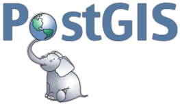

# Metageos



 We must utilize Edit `SQL View` at geoserver to handle flexible needs in PostGIS support.
 So, we consider ANSI SQL and PostGIS compatibility. especially, SQL **join** and table **partitioning** syntax for agility.

<br>

<p align="center">
  
</p>

## Up and running

Build mvn java project.

```bash
 ~/metageos$ bash scg-wms-request-sharder/mvnw clean package
 ~/metageos$ bash spring-schedule/mvnw clean package
```

Then, we can execute containerized services.

```bash
 ~/metageos$ docker-compose --compatibility up -d
```

```bash
 ~/metageos$ docker-compose ps
         Name                        Command                   State                                                                          Ports
----------------------------------------------------------------------------------------------------------------------------------------------------------------------------------------------------------------------
crdb-0                    /cockroach/cockroach.sh st ...   Up               26257/tcp, 8080/tcp
crdb-1                    /cockroach/cockroach.sh st ...   Up               26257/tcp, 8080/tcp
crdb-2                    /cockroach/cockroach.sh st ...   Up               26257/tcp, 8080/tcp
crdb-init                 java org.springframework.b ...   Exit 0
lb                        /docker-entrypoint.sh hapr ...   Up               0.0.0.0:26257->26257/tcp,:::26257->26257/tcp, 0.0.0.0:8080->8080/tcp,:::8080->8080/tcp, 0.0.0.0:8081->8081/tcp,:::8081->8081/tcp   
metageos_catalog_1        sh -c exec dockerize --tim ...   Up (healthy)
metageos_config_1         sh -c exec dockerize --tim ...   Up (healthy)
metageos_database_1       docker-entrypoint.sh postgres    Up (healthy)     0.0.0.0:5432->5432/tcp,:::5432->5432/tcp
metageos_discovery_1      /bin/sh -c exec java $JAVA ...   Up (healthy)     0.0.0.0:8761->8761/tcp,:::8761->8761/tcp
metageos_gateway_1        sh -c exec dockerize --tim ...   Up (healthy)     0.0.0.0:9090->8080/tcp,:::9090->8080/tcp
metageos_rabbitmq_1       docker-entrypoint.sh rabbi ...   Up               15671/tcp, 0.0.0.0:15672->15672/tcp,:::15672->15672/tcp, 15691/tcp, 15692/tcp, 25672/tcp, 4369/tcp, 5671/tcp,
                                                                            0.0.0.0:5672->5672/tcp,:::5672->5672/tcp
metageos_rest_1           sh -c exec dockerize --tim ...   Up (healthy)
metageos_wcs_1            sh -c exec dockerize --tim ...   Up (healthy)
metageos_webui_1          sh -c exec dockerize --tim ...   Up (healthy)
metageos_wfs_1            sh -c exec dockerize --tim ...   Up (healthy)
metageos_wms_1            sh -c exec dockerize --tim ...   Up (healthy)
pg-postgis-0              docker-entrypoint.sh postgres    Up               0.0.0.0:30000->5432/tcp,:::30000->5432/tcp
pg-postgis-1              docker-entrypoint.sh postgres    Up               0.0.0.0:30001->5432/tcp,:::30001->5432/tcp
scg-wms-request-sharder   java -Djava.security.egd=f ...   Up (unhealthy)   8081/tcp, 0.0.0.0:9010->9010/tcp,:::9010->9010/tcp
spring-schedule           java -Djava.security.egd=f ...   Up (unhealthy)   8081/tcp, 0.0.0.0:9000->9000/tcp,:::9000->9000/tcp
```

## 1. Cockroach DB based auto scaling, auto sharding, auto rebalancing

- cloud based autoscale
  - K8S MSA
  - docker cluster MSA

`Openlayers WMS http request → geoserver cloud → Cockroach DB`

All nodes can utilize replication.

## 2. Adhoc scale out by PG Mannual Sharded cluster with request parameter based dynamic route gateway

- Adhoc with mannual sharding
  - On-premise host based

Use Spring cloud Gateway by WMS BBOX routing and Shareded PG.

```
Openlayers WMS http request → scg (WMS BBOX based request shard)
                               ↪ geoserver cloud
                                   ├── geoserver-0 → postgis-0
                                  ...
                                   └── geoserver-n → postgis-n
```

scg nodes can utilize replication.

## Reference

- [Geoserver Cloud](http://geoserver.org/geoserver-cloud/)
  - [docker-compose.yml](https://geoserver.github.io/geoserver-cloud/deploy/docker-compose/stable/docker-compose.yml)
  - [geoserver-cloud-config](https://github.com/geoserver/geoserver-cloud-config)

- CockroachDB
  - [cockroachlabs-field/docker-examples](https://github.com/cockroachlabs-field/docker-examples)
  - [local cluster with monitoring dashboard](https://www.cockroachlabs.com/docs/stable/start-a-local-cluster-in-docker-mac.html)

- [OSM tile server](https://github.com/Overv/openstreetmap-tile-server)

- Springboot
  - [Springboot Schedule](https://github.com/spring-guides/gs-scheduling-tasks)
  - [Springboot Websocket](https://github.com/callicoder/spring-boot-websocket-chat-demo.git)
