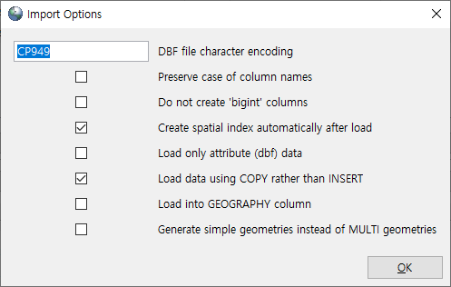
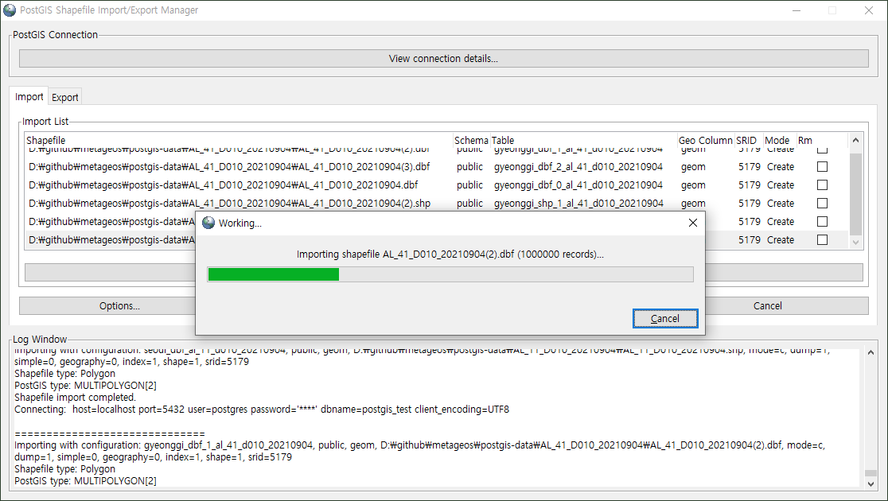

# postgis-data sample

Do unzip sample files.

```bash
 $ unzip gyeonggi-AL_41_D010_20210904.zip
```

This files imported with `CP949` encoding.

Use `shp2pgsql-gui` or `shp2pgsql` on `.shp` and `.dbf` file.

Setup import options.

<p align="center">
    
</p>


Then `COPY` to db. 


<p align="center">
    
</p>


```sql
 SELECT * FROM gyeonggi-AL_41_D010_20210904
```

If srid is not imported, then setup srid.

```sql
 SELECT UpdateGeometrySRID('gyeonggi-AL_41_D010_20210904','geom',5174);
```
